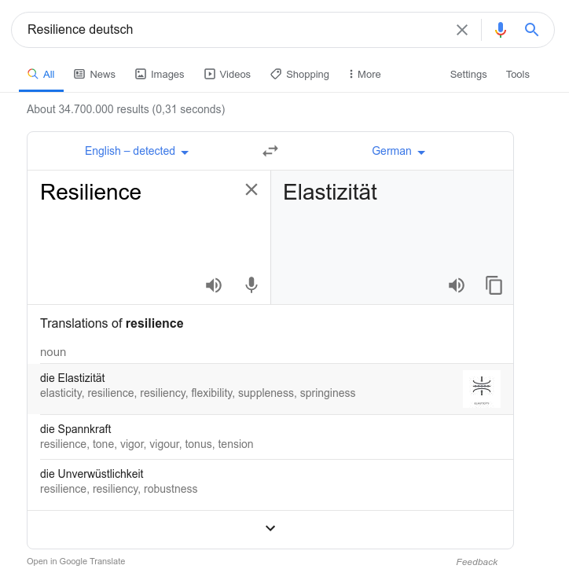
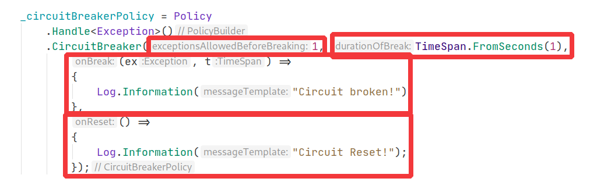

<h2 style="position: absolute; top: 100px; color: #000; text-transform: none;">Polly: Eine "Resilience" Bibliothek</h2>
<h3 style="position: absolute; top: 300px; color: #000; text-transform: none;">(Kategorie: nuetzliche NuGet Pakete)</h3>


<div style="position: absolute; top: 520px; right: -150px; color: #ccc; text-transform: none; text-align: right" class="my-shadow">
</br><i class="fa fa-calendar" aria-hidden="true"></i>&nbsp;2020-06-22
</div>

<div style="position: absolute; top: 520px; left: -145px; color: #ccc; text-transform: none; text-align: right" class="my-shadow">
    <ul style="list-style: none;">
        <li>Patrick Drechsler</li>
        <li>Redheads Ltd.</li>
    </ul>
</div>

---



---

## Resilience

Fehlerhaftes Verhalten von anderen/externen Diensten als "normal" betrachten

---

> Polly is a .NET **resilience** and transient-fault-handling library that **allows developers to express policies such as Retry, Circuit Breaker, Timeout**, Bulkhead Isolation, and Fallback **in a fluent and thread-safe manner**. Polly targets .NET 4.0, .NET 4.5 and .NET Standard 1.1.

---

## Polly Project

- stabiles, gepflegtes Repo
- grosse Community
- [https://github.com/App-vNext/Polly](https://github.com/App-vNext/Polly)
- [http://www.thepollyproject.org](http://www.thepollyproject.org)

---

## Was sind Policies?

**Policies** beschreiben das Verhalten, wenn was schief geht

---

## Beispiel "Policies"

- **Timeout**
  - "Antwort dauert länger als 10sec"
- **Retry**
  - "keine Antwort -> nochmal probieren"
- **Circuit Breaker**
  - "wenn... -> verhindere weiter Anfragen, damit sich der Dienst erholen kann"
- ...

---

## Beispiel 1: Retry

```csharp
public class BusinessLogic
{
  private readonly IFlakyService _srv;

  public BusinessLogic(IFlakyService service) => _srv = service;

  public int CallFlakyMethod() 
  {
    return _srv.SlowMethod(); // <- SLOW!!
  }
}
```

---

```csharp
  public int CallFlakyMethod() 
  {
    return _srv.SlowMethod();
  }
```

---

`Policy.Execute(...)`

```csharp
  public int CallFlakyMethod() 
  {
    return _policy.Execute(() => _srv.SlowMethod());
  }
```

---

`Policy.ExecuteAndContain(...)`

```csharp
  public int CallFlakyMethod() 
  {
    var policyResult = 
      _policy.ExecuteAndContain(() => _srv.SlowMethod());

    // TODO
  }
```

---

Policies koennen sehr feingranular definiert werden, z.B.:

- erst: 3x Retry
- dann: 2x Retry mit logarithmischen Abstaenden (in 2min, in 20min, etc)
- dann: Circuit Braker
- dann: Failover

---

## Beispiel 2: Circuit Breaker

```csharp
var circuitBreakerPolicy = Policy
  .Handle<Exception>()
  .CircuitBreaker(1, TimeSpan.FromSeconds(1),
      (ex, t) =>
      {
          Log.Information("Circuit broken!");
      },
      () =>
      {
          Log.Information("Circuit Reset!");
      });
```

---


